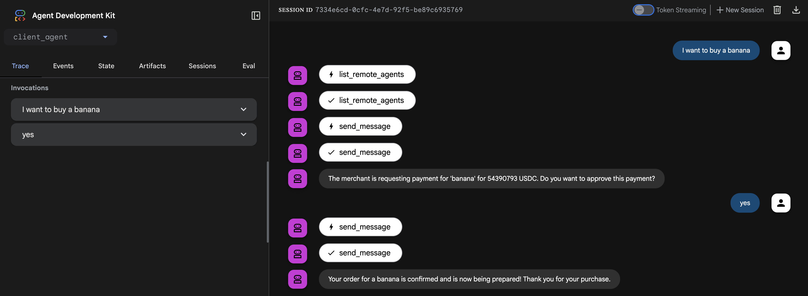

# ADK KyaPay Payment Protocol Demo

This project demonstrates a complete, end-to-end payment flow between two agents using the **A2A KyaPay Payment Protocol Extension**. It serves as a reference implementation for developers looking to add JWT-based payment capabilities to their own agents.

The demo consists of two main components:
1. A **Client Agent** that acts as an orchestrator, delegating tasks and handling the user-facing interaction.
2. A **Merchant Server** that hosts a specialized agent capable of selling items and processing payments using the KyaPay protocol.

The reusable, core logic for the KyaPay protocol is encapsulated in the `kyapay_a2a` Python library, located in the `python/kyapay_a2a/` directory of the parent repository.

## How to Run the Demo

### Prerequisites
- Python 3.11+ < 3.14
- `uv` (for environment and package management)
- Google API key (you can create one [here](https://ai.google.dev/gemini-api/docs/api-key))
- Follow the [Skyfire Platform Setup Guide](https://docs.skyfire.xyz/docs/introduction) to create Skyfire API key, seller service, and get seller api key. 

### 1. Setup the Environment

First, sync the virtual environment to install all necessary dependencies, including the local `kyapay_a2a` library in editable mode.

Run this command from the root of the repository:
```bash
uv sync --directory=python/examples/adk-demo
```

Set your API keys as environment variables:

> **Warning:** Do not hardcode or commit your API keys. The commands below set the variables for the current session only. For persistence, add them to your shell's startup file (e.g., `~/.bashrc`, `~/.zshrc`) or use a `.env` file.

**Linux/macOS .env**
```bash
GOOGLE_API_KEY="your_google_api_key"
SKYFIRE_API_KEY="your_buyer_api_key"
SKYFIRE_SELLER_API_KEY="your_seller_api_key"
SKYFIRE_API_HOST="https://api.skyfire.xyz"
BUYER_TAG="demo-buyer"
SELLER_SERVICE_ID="your-seller-service-uuid"
```

**Windows (PowerShell):**
```powershell
$env:GOOGLE_API_KEY="your_google_api_key"
$env:SKYFIRE_API_KEY="your_buyer_api_key"
$env:SKYFIRE_SELLER_API_KEY="your_seller_api_key"
$env:SKYFIRE_API_HOST="https://api.skyfire.xyz"
$env:BUYER_TAG="demo-buyer"
$env:SELLER_SERVICE_ID="your-seller-service-uuid"
```

### 2. Start the Merchant Agent Server

The merchant server hosts the agent that sells datasets.

Run this command from the root of the repository:
```bash
uv --directory=python/examples/adk-demo run server
```

You should see logs indicating the server is running, typically on `localhost:10000`.

### 3. Start the Client Agent & Web UI

The client agent is an orchestrator that communicates with the merchant. The ADK provides a web interface to interact with it.

Run this command from the root of the repository:
```bash
uv --directory=python/examples/adk-demo run adk web --port=8000
```

This will start the ADK web server, usually on `localhost:8000`. Open this URL in your browser to interact with the client agent and start the purchase flow.

### 4. Try the Payment Demo

Once both servers are running and you've navigated to the web UI, you can test the KyaPay payment flow by selecting the `client_agent` and entering this prompt:

   Find a dataset for pickup truck sales in US in the year 2024.
   If dataset cost is under my budget of $0.005 then proceed with purchasing.

The client agent will:
1. Discover available merchants
2. Search for datasets
3. Request payment details from the merchant
4. Prompt you for confirmation
5. Create a payment token via Skyfire API
6. Submit the token to the merchant
7. Receive the download URL for the purchased dataset



## Architectural Flow

The demo showcases a clean separation of concerns between the agent's business logic and the payment protocol logic.

### 1. Merchant-Side (Server)

**AdkMerchantAgent** (`adk_merchant_agent.py`):
- Contains the core business logic (searching datasets, providing product details)
- When payment is required, raises `KyaPaymentRequiredException` with payment requirements
- No payment logic in the agent itself - pure business logic

**KyaPayMerchantExecutor** (`kyapay_merchant_executor.py`):
- Wraps the ADK agent executor
- Intercepts `KyaPaymentRequiredException` and creates `payment-required` response
- Receives payment token from client
- Verifies token via Skyfire JWKS (JWT signature verification)
- Charges token via Skyfire API
- Passes control back to agent after successful payment

This executor is "injected" in `routes.py`, wrapping the core `ADKAgentExecutor`.

### 2. Client-Side (ClientAgent)

**ClientAgent** (`client_agent.py`):
- Acts as the user's proxy
- `send_message` tool handles all communication with merchant
- When receiving `payment-required` response:
  1. Extracts payment requirements from task metadata
  2. Prompts user for confirmation
  3. Creates JWT payment token via Skyfire API
  4. Submits token in `payment-submitted` message
- Uses `KyaPayUtils` from the core library to manage payment state

## Payment Flow Details

### Step 1: Payment Required

```python
# Merchant raises exception
raise KyaPaymentRequiredException(
    product_name="US Automobile Data - 2024",
    requirements=KyaPayRequirements(
        seller_service_id="uuid",
        token_amount="0.002",  # USDC
        token_type="pay",
        description="Payment for: US Automobile Data - 2024",
        resource="https://example.com/dataset.csv"
    )
)

# KyaPayServerExecutor converts to A2A response
Task(
    status=TaskState.input_required,
    metadata={
        "kyapay.payment.status": "payment-required",
        "kyapay.payment.required": {
            "kyapay_version": 1,
            "accepts": [requirements]
        }
    }
)
```

### Step 2: Client Creates Token

```python
# Client calls Skyfire API
token = await create_token(
    requirements=requirements,
    buyer_tag="demo-buyer",
    skyfire_api_key=SKYFIRE_API_KEY,
    skyfire_api_host=SKYFIRE_API_HOST
)

# Returns KyaPayToken with JWT
{
    "token": "eyJhbGciOiJSUzI1NiIsInR5cCI6IkpXVCJ9...",
    "token_type": "pay",
    "buyer_tag": "demo-buyer"
}
```

### Step 3: Merchant Verifies and Charges

```python
# 1. Verify JWT signature using Skyfire JWKS
verify_response = await verify_token(token, requirements)

# 2. Charge token via Skyfire API
charge_response = await charge_token(
    token=token,
    charge_amount="0.002",
    skyfire_seller_api_key=SKYFIRE_SELLER_API_KEY,
    skyfire_api_host=SKYFIRE_API_HOST
)

# 3. Return success with resource URL
Task(
    status=TaskState.completed,
    metadata={
        "kyapay.payment.status": "payment-completed",
        "kyapay.payment.receipts": [{
            "success": true,
            "amount_charged": "0.002",
            "transaction_id": "txn_abc123"
        }],
        "kyapay_payment_verified": true,
        "kyapay_payment_requirements": {
            "resource": "https://example.com/dataset.csv"
        }
    }
)
```

## Key Differences from Traditional Payment Systems

### No Blockchain Wallets
- Uses JWT tokens instead of blockchain signatures
- No private keys for users to manage
- No gas fees or transaction delays

### API-Based
- Token creation via Skyfire API (`POST /v1/tokens`)
- Token verification via JWKS (JWT signature validation)
- Token charging via Skyfire API (`POST /v1/tokens/{id}/charge`)

### Simpler Integration
- Exception-based payment requests
- Automatic executor wrapping
- No wallet integration needed

## Environment Variables

| Variable | Description | Required |
|----------|-------------|----------|
| `GOOGLE_API_KEY` | Google Gemini API key for ADK agents | Yes |
| `SKYFIRE_API_KEY` | Skyfire API key for buyer/client | Yes (client) |
| `SKYFIRE_SELLER_API_KEY` | Skyfire API key for seller/merchant | Yes (server) |
| `SKYFIRE_API_HOST` | Skyfire API endpoint | No (defaults to prod) |
| `BUYER_TAG` | Optional buyer identifier | No |
| `SELLER_SERVICE_ID` | Skyfire seller service UUID | Yes (server) |

## Example Prompt

Try these prompts in the web UI:

1. **Search and Purchase:**
   ```
   Find a dataset for pickup truck sales in US in the year 2024.
   If dataset cost is under my budget of $0.005 then proceed with purchasing.
   ```

## Code Structure

```
python/examples/adk-demo/
├── client_agent/
│   ├── client_agent.py          # Main client agent with payment handling
│   └── _remote_agent_connection.py  # A2A connection management
├── server/
│   ├── agents/
│   │   ├── adk_merchant_agent.py        # Business logic (sells datasets)
│   │   ├── kyapay_merchant_executor.py  # Payment protocol wrapper
│   │   ├── _adk_agent_executor.py       # ADK integration layer
│   │   └── routes.py                    # FastAPI routes
│   └── main.py                          # Server entry point
└── pyproject.toml
```

## Troubleshooting

### Server won't start
- Check that `SELLER_SERVICE_ID` and `SKYFIRE_SELLER_API_KEY` are set
- Verify port 10000 is available

### Client can't connect
- Ensure server is running on localhost:10000
- Check ADK web UI is on localhost:8000

### Payment fails
- Verify both `SKYFIRE_API_KEY` (client) and `SKYFIRE_SELLER_API_KEY` (server) are valid
- Check `SELLER_SERVICE_ID` matches your Skyfire seller service
- Ensure token amounts are in valid decimal format (e.g., "0.002")

### Resource URL not returned
- Check server logs for "kyapay_payment_verified" and "kyapay_payment_requirements" in metadata
- Verify the merchant agent sets the `resource` field in `KyaPayRequirements`

## License

Apache License 2.0 - See LICENSE file for details.
